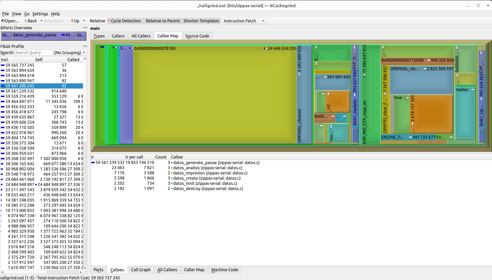
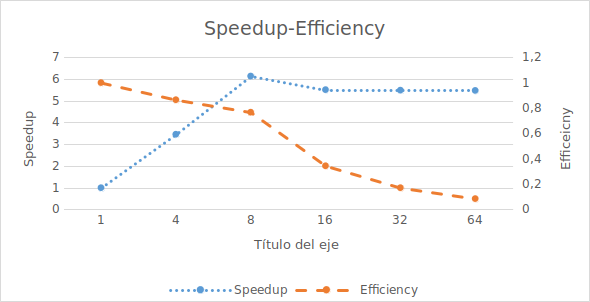

Dario Murillo Chaverri C15406 <<dario.murillo@ucr.ac.cr>> 2023a

# Optimización 1

La primera parte de este reporte consiste en presentar la optmizacion propuesta libremente por nosotros sobre la primer tarea, es decir, la primer version serial que se creo. Para esto se seguira paso a paso el ciclo de optimizacion propuesto.

## Rendimiento

El primer paso de este ciclo, consiste en tomar la duracion del programa a optimizar, para esto, tomamos el tiempo de ejecuccion de nuestro programa mediante la herramienta perf. La ejecuccion de este codigo se llevo a cabo en un sistema operativo linux, en una computadora con 16 nucleos y con 32 gb de RAM, con un caso de prueba grande. El caso de prueba utilizado fue el input008, el cual es un caso de pruebas especial, creado para las multiples mediciones de tiempo y concurrencia llevadas a cabo, es decir no es uno de los casos brindados provicionalmente, si no uno creado independientemente. La duracion de la version serial, es decir, de la tarea01 con este caso de pruebas fue de 888,39417887 segundos aproximadamente 15 minutos.

## Profiling y Análisis

En el segundo paso, llevamos a cabo un análisis dinámico de rendimiento (profiling) mediante la herraminta callgrind. Luego visualisamos los resultados, para analizar cuales partes de codigo son las que requieren mas procesamiento, y por lo tanto, cuales son las parte que se deben optimizar.

Como podemos observar mediante los graficos y el apoyo visual de la herramienta de profiling, podemos determinar que las partes del programa que mas requieren procesamiento y por lo tanto las que toman mas tiempo, son las funciones encargadas de la generacion de claves y la apertura de los archivos, las cuales trabajan de manera conjunta. Debido a que el algoritmo es un algoritmo de fuerza bruta, que debe generar y probar todas las claves posibles hasta que encuentre la que descifra el archivo o haya probado todas las claves posibles. El diseño de optimizacion va a optar por aliviar el trabajo a la hora de abrir los archivos.

## Diseño

Como se menciono anteriorment el diseño de mi solucion va a consistir  en alivianar la carga de trabajo al tener que abrir archivos. Esto se logra, al cambiar el funcionamiento de la funcion datos_abrir_archivos, ya que actualmente por cada clave que genera la funcion datos_generate_passw, es pasada como argumento al metodo datos_abrir_archivo que se encarga de abrir el zip que tambien se especifica como argumento, luego de reservar la memoria necesaria intenta abrir el archivo dentro del zip con la clave, en caso de ser exitosa devuelte true, de lo contrario false. 

Si analisamos, se esta abriendo y cerrando los archivos zips y reservando y liberando memoria, cada vez que generamos una nueva clave, este trabajo se puede simplificar al abrir el archivo y reservar la memoria necesaria, una unica vez antes de empezar a probar todas las claves para abrir el archivo dentro, y liberar esta memoria y cerrar el archivo una vez que se haya encontrado la clave o se hayan agotado las claves a probar.

## Resultados

La optimizacion fue exitosa ya que disminuyo el tiempo de ejecuccion del programa sustancialmente. El tiempo de ejecuccion, en el caso de prueba input008 fue de 867,665801882 segundos mientras que la version serial duro 888,39417887 segundos.

1. Speedup: 1,023889817
2. Eficiencia: 1

La eficiencia es la misma al speed up ya que al ser una optimizacion serial solo hay un trabajador.

## Lecciones aprendidas

Luego de realizar la primer optimizacion, se puede concluir que la si bien la paralelizacion de tareas es una herramienta muy efectiva para aumentar el rendimiento de un programa, tambien podemos recurrir a soluciones que no requieren la reparticion de trabajo o el uso de multiples hilos de ejecuccion. Gracias a herramientas de profiling como la usada, podemos identificar que partes de nuestro programa toman la mayor cantidad de trabajo y en base a esto, podemos crear una optimizacion eficiente que cree una mejora corrorable en el programa. 

Esto es muy util ya que si bien, la paralelizacion de un programa puede aumentar su desempeño, puede ser que nos veamos en la necesidad de optimizar un programa sin la posibilidad de hacerlo multihilo, es decir que sea un programa estrictamente serial, ya sea porque la implementacion de multiples hilos complica mucho el codigo  o porque se busca una solucion que no provoque afecte la metrica de eficiencia.

# Optimización 2

## Diseño

La optimización 2 consiste en hacer mejorar el rendimiento del programa al paralelizar tareas, es decir, hacer el programa concurrente repartiendo el trabajo de la generacion de claves lo mas equitativamente posible entre multiples hilos mediante un mapeo estatico por bloque.

## Resultados

La optimización 2 la cual consiste de la paralelizacion multihilos con un mapeo estatico duro 158,165189687 segundos con el caso de pruba input008, es decir, alredor de 3 minutos, por lo tanto, si consiguio aumentar significativamente el desempeño del programa.

1. Speedup: 5,6168755
2. Eficiencia: 0,351054719

## Lecciones aprendidas

Dependiendo del programa que estemos haciendo tener un solo hilo efectuando una tarea puede llegar a ser sumamente ineficiente, ya sea porque es una tarea que toma mucho tiempo, o porque requiere de muchos recursos del procesador.

En este programa nos encontramos con un caso en el que ciertas partes pueden conllevar una gran cantidad de trabajo. Como analizamos en la seccion de profiling, la generacion de claves junto con la apertura de archivos, requieren muchos llamados y toman la mayor parte del tiempo de ejecuccion, ya que en ocasiones son muchas las claves que se deben probar para llegar a la respuesta, o en el peor caso se deben probar todas las claves posibles para agotar las posibles soluciones.

Es de esta manera que se llego a la desicion de implementar una version concurrente, que consiste en repartir el trabajo de generacion de claves y apertura de archivos, entre varios hilos de manera equitativa, para que asi cada hilo pueda trabajar de manera paralela con un menor rango de claves. 

Esto no solo disminuye significativamente la cantidad de trabajo de cada hilo al disminuir el rango de claves sobre el cual trabaja, si no que hace que multiples claves se prueben al mismo tiempo. Es entonces, que podemos determinar que el mapeo estatico por bloque, puede generar resultados positivos a la hora de trabajar con tareas grandes, que luego son descompuestas en tareas mas pequeñas. Por lo tanto, hay que ser cuidadoso al elegir la granularidad y descomposicion que se desea llevar a cabo a la hora de paralelizar un programa para aumentar su rendimiento.

# Optimización 3

La tercera optimización consiste en paralelizar el programa, pero esta vez mediante un mapeo dinámico por medio del patrón productor-consumidor. Al igual que el resto de las optimizaciones, se seguira paso a paso el ciclo de optimización.

## Rendimiento
 
La duracion de la version con mapeo dinamico, la cual fue realizada en la misma computadora y con el mismo caso de prueba utilizados para las optimizaciones anteriors, fue de 161,242806986 segundos, osea, aproximadamente 3 minutos.

## Diseño

A diferencia de las optimizaciones anteriores, esta optimizacion consiste en aplicar un mapeo dinamico, mediante el patron productor consumidor.

Para lograr lo propuesto, se escogio la apertura de archivos como la unidad de descomposicion y el trabajo que realizaran los hilos consumidores. Ademas, se implemento un buffer no acotado mediante una cola thread-safe. El productor, el cual es el hilo principal pone claves en esta cola, y multiples hilos consumidores, extraen claves de esta cola para probar intentar desencriptar todos los archivos zips que fueron introducidos, en caso exitoso se agrega la clave a un arreglo de respuestas thread-safe.

## Resultados

En este caso, la solucion de mapeo dinamico presento un aumento del desempeño significativo respecto a la version serial, al igual que la version con mapeo estatico por bloque, sin embargo, esta version tuvo un peor speedup y eficiencia que la implementada con el otro mapeo.

1. Speedup: 5,509667039
2. Eficiencia: 0,34435419

## Lecciones aprendidas

Si bien se ha estudiado que el mapeo dinamico es un mapeo que suele generar soluciones mas efectivas que los demas tipos de mapeo en la mayoria de los casos, los resultados de estas pruebas fueron muy enriquecedores para poder comprobar como no siempre esto sucede y que dependiendo del problema, el tipo de mapeo, la granulidad e incluso la unidad de descomposicion, asi como la implementacion del paralelismo mediante en el programa, pueden cambiar drasticamente el rendimiento del programa.

La solucion mediante el mapeo dinamico, por medio del productor consumidor genero mejores resultados que la version serial, ya que esta tiene un tiempo de ejecuccion de aproximadamente 15 minutos, mientras que esta version dura aproximadamente 3 minutos al usar 16 hilos, sin embargo, es importante notar que esta version con mapeo dinamico sigue siendo peor que la version de mapeo por bloque, la cual, con la misma cantidad de hilos tiene un tiempo de ejecuccion de aproximadamente 3 minutos.

Es interesante entonces analizar porque a pesar de que ambos son programas concurrentes, los cuales fueron probados con el mismo caso de pruebas y con la misma cantidad de hilos, presentan tiempos de ejecuccion distintos, ya que la version por bloque dura casi la mitad del tiempo que dura la version con mapeo dinamico.

Una posible explicacion de porque sucede esto es que el tipo de mapeo y la unidad de descomposicion elegida en ambas soluciones es distinto, ya que en la version por bloque se reparte tanto, el trabajo de generacion de claves, asi como de apertura de archivos equitativamente entre los hilos disponibles, esto se hace para todos los archivos zips introducidos. Por otro lado, en el mapeo dinamico, hay solo un hilo generando claves y poniendolas en una cola, mientras hay multiples hilos consumiendo de esta, estos hilos igual tiene que probar esta clave con cada archivo introducido.

Es entonces muy util despues de analizar estos resultados poder llegar a entender, que paralelizar un programa con multiples hilos, puede generar resultados muy distintos dependiendo de la manera en que se implemente, y que por lo tanto, no se debe tomar a la ligera la parte de analisis y se debe ser muy cuidadoso a la hora de elegir el mapeo, la granularidad, unidad de descomposicion y la implementacion que se desea llevar a cabo, ya que dependiendo de esto podemos llegar a mejores resultados, y en ocasiones una mala implementacion podria llegar a causar un efecto adverso e incluso empeorar el rendimiento de un programa. 

# Optimizaciones

Una vez que las optimizaciones fueron realizadas se pueden hacer las mediciones para comparar distintos criterios de los programas. En esta seccion, se comparara el incremento de desempeño, para facilitar esto se muestran los siguientes graficos creados en base a los resultados obtenidos luego de las mediciones.
 
Estas mediciones fueron realizadas todas en la misma computadora, con el mismo caso de pruebas el input008, ademas, para los programas concurrentes se uso el numero de CPUs disponibles como la cantidad de hilos, es decir, 16 hilos.

El primer graficos muestra en comparacion la duracion del programa en segundos y el speedup obtenido respecto a la version serial.

El segundo grafico muestra la comparacion entre el speedup y la eficiencia.

Como podemos notar, la version que produjo un menor tiempo de ejecuccion y por lo tanto la que tuvo consecuentemente  un mayor speedup, fue la version pthreads, es decir, la version concurrente con mapeo de bloque estatico. La version de productor-consumidor, produjo resultados muy parecidos, aunque un poco peores que los de la version pthreads, esto se ve reflejado en el leve aumento que se ve en la linea de grafico en el eje de duraciones.

Es natural que las versiones multihilos produzcan mucho mejores resultados, que la version serial, y la optimizacion de la version serial, la cual, si bien produce mejores resultados, al tener un menor tiempo de duracion y un leve speedup, es un aumento mucho mas insignificante que las versiones anteriores. 

Por otro lado, si bien las versiones de mapeo dinamico suelen producir mejores resultados que otros tipos de mapeo, ya que los hilos toman la siguiente unidad de trabajo disponible cuando se desocupan, esto no es constante, ya que dependiendo del programa a optimizar hay otros aspectos como la unidad de descomposicion o la granularidad del problema que puede hacer que otros tipos de mapeo produzcan mejores resultados, en el caso de nuestro programa si bien los resultados fueron muy similares esta version duro unos segundos mas que la version de bloque, lo que significa que no obtuvo un incremento del desempeño respecto a la otra version concurrente. 

Despues de analizar los resultados, podemos concluir entonces, que el mapeo estático por bloque el cual asigna rangos continuos de trabajo a cada trabajador, resulto ser mucho mas eficiente para la reparticion de claves al dividir el trabajo  tanto de la produccion de claves como la de apertura de archivos equitaivamente, a diferencia de la version productor-consumidor, en la cual solo un hilo produce claves mientras otros consumen para intentar abrir los archivos con las claves que extraen del buffer. Sin embargo, si es importante destacar que ambas versiones fueron mejores respecto a la version serial, asi como la optimizacion serial de esta misma.

# Grado de concurrencia

Una vez comparado los tiempos de ejecuccion y el speedup entre las distintas versiones, podemos analizar el comportamiento de los programas concurrentes con distintos grados de concurrencia. Las mediciones fueron realizadas todas en la misma computadora, con el mismo caso de pruebas el input008, lo unico que cambio en cada medicion fue la cantidad de hilos utlizados.

Este primer grafico muestras los distintos resultados de concurrencia respecto a la version pthreads, es decir la de mapeo, con bloque estatico.

El segundo grafico muestra los distintos resultados de concurrencia respecto a la version dinamico, es decir la version con productor-consumidor.

Una vez que obtenemos los resultados de las pruebas, y tenemos el apoyo visual de los graficos para poder analizar su comportamiento, podemos notar que los graficos de ambas versiones se ven similares, como ya fue mencionado anteriormente, esto se debe a que si bien la version pthread obtuvo mejores resultados, la diferencia comparada con la version dinamica es de unos pocos segundos, por lo tanto es dificil verlo reflejado en el grafico.

En cuanto a la cantidad de hilos, si se puede notar que en ambas versiones 4 hilos, es lo que produce un menor speedup respecto a la version serial, esto es esperado ya que es una cantidad de hilos muy pequeña, y hace que haya una mucha menor paralizacion de datos, aunque esto tambien hace que haya un mejor uso de los recursos, por lo tanto, presenta mejor eficiencia que las otras versiones

Por otro lado, 8 hilos fue lo que produjo un menor tiempo de ejecuccion y por lo tanto un mayor speedup respecto a la version serial, esto es un resultado esperado, ya que normalmente la cantidad optima de hilos a usar al correr un programa paralelo suele ser la cantidad de CPU's disponibles en la maquina o incluso menor.  En este caso, las pruebas se realizaron en una computadora que si bien posee 16 nucleos, solo 8 de ellos son nucleos fisicos, es decir, los demas son nucleos logicos o virtuales.

De igual manera, tambien podemos notar que los resultados al usar 16,32 y 64 hilos no solo son peores que al usar 8 hilos, si no que el rendimiento del programa suele ser el mismo o incluso suele empeorar por algunos segundos conforme aumenta el numero de hilos. Esto se debe a que usar mas hilos en un programa no siempre asegura un incremento del desempeño, si no que mas bien puede causar resultados peores al saturar los recursos del sistemas, esto de hecho se puede ver reflejado en el eje de rendimiento el cual se reduce significativamente conforme se le agregan hilos, ademas de que un exceso de hilos puede resultar en que muchos de estos pasen la mayoria de tiempo en espera para poder trabajar. Por lo tanto, podemos concluir que la cantidad optima de hilos para conseguir el mejor rendimiento, considerando tanto el speedup como la eficiencia, es 8 hilos.